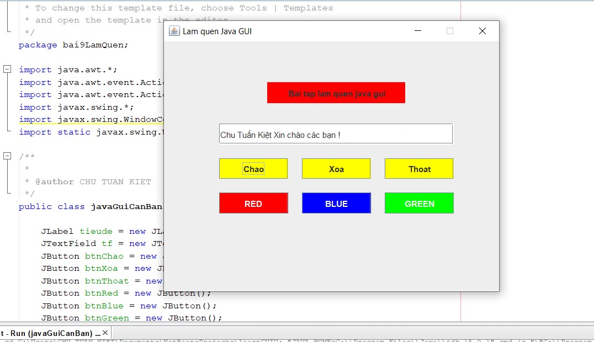

# Chương trình cơ bản làm quen các thành phần của Java GUI, Java Swing

*Button Chao : Hiển thị ra đoạn text ra text field
*Button Xoa : Xóa nội dung và màu sắc của Text field
*Button Thoat : Thoát chương trình
*Button RED : set Text field thành màu Đỏ
*Button BLUE : set Text field thành màu Xanh lam
*Button GREEN : set Text field thành màu Xanh Lá

